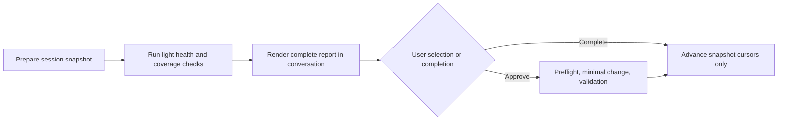

# AI Workspace Improver

[中文](README.md) · English

`ai-workspace-improver` is a local-first governance skill for a personal AI
workspace. It reviews Copilot and Codex sessions alongside token coverage,
runtime friction, skills, shared guidance, personal knowledge, and workspace
structure, then proposes only evidence-backed improvements.

## Why

Conversation history reveals retry loops, missing tools, trigger gaps, and
knowledge opportunities. Guidance, skills, and wikis also accumulate misplaced,
duplicated, or stale instructions. This skill audits both sides so session
collection is not mistaken for asset health.

## Capabilities and boundaries

| Capability | Behavior |
| --- | --- |
| Cross-tool sessions | Incremental local Copilot/Codex collection; Codex rollouts become logical sessions |
| Delivered report | The complete result is rendered in the active conversation; Markdown is an audit copy |
| Token coverage | Optionally reads an already-installed `ccusage`; never auto-installs or invents Copilot cost |
| Runtime friction | Summarizes sandbox, network, tool-failure, and escalation categories without raw output |
| Asset health | Light checks every review; deep audit every five completed reviews or explicit `assets` focus |
| Safe changes | Every asset/Git change requires selection; no daemon, commit, push, or silent repair |

PlantSim help is an agent attachment. The skill checks only its declaration,
index, and retrieval structure; it is not treated as personal knowledge or
preloaded into context.

## Usage

Ask for `daily review`, `self-improving`, `skill review`, `token review`,
`workspace health`, or `asset audit`. Optional focus: `conversations`,
`tokens`, `assets`, or `workspace`.



## Report example

```markdown
## Review summary
- Sources: Copilot 3 logical sessions; Codex 7 logical sessions (12 segments)
- Snapshot: review-...; not yet finalized

## Runtime incidents
- sandbox_permission ×2; recovered after approved escalation

## Token coverage
- ccusage: unavailable; Copilot Chat exact token coverage unavailable

## Asset health
- Errors: none
- Warnings: one global-rule scope candidate
```

## Token limitations

`ccusage` is optional and local. The skill only detects an installed binary;
when unavailable it reports the coverage gap and a manual-install hint. Usage
is attributed to a session, project, or explicitly invoked skill only when the
session ID matches exactly. Copilot Chat without native usage data receives a
message-volume proxy, never an estimated cost.

## Privacy and local state

`review_state.json`, `reviews/`, `skill_change_log.md`, and token aggregates
are Git-ignored. They contain cursor ceilings, snapshots, redacted findings,
and aggregate metrics—never raw chat, commands, or tool output.

## Development and migration

```bash
python -m unittest discover -s tests -v
```

Run workspace checks with `bin/ai-workspace lint --json`. Before changing the
skill, read the [capability migration matrix](references/migration-matrix.md):
every migration must explicitly preserve, replace, or deprecate each capability.
