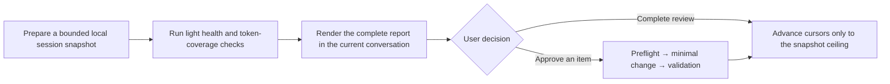

<div align="center">

# 🔄 AI Workspace Improver

### Turn AI-session experience into better skills, guidance, and knowledge—not more context debt

[](https://github.com/features/copilot)
[](https://openai.com/codex/)
[](https://www.python.org/)
[](LICENSE)

[中文](README.md) · English

[Why](#-why) · [What it does](#-what-it-does) · [Quick start](#-quick-start) · [Workflow](#-workflow) · [Privacy and boundaries](#-privacy-and-boundaries)

</div>

---

## 🤔 Why

Every AI-assisted task leaves useful signals: repeated tool failures, skills that did not trigger, overgrown guidance, stale knowledge links, and workflows blocked by a sandbox or network. Those signals usually remain scattered across chat histories, configuration folders, and wikis until they become unmaintained context debt.

`ai-workspace-improver` is a local-first governance skill. When you explicitly invoke it, it reviews locally available Copilot and Codex sessions together with managed skills, shared guidance, personal knowledge, and workspace structure. It delivers evidence-backed recommendations; it does not silently “optimize” your environment.

The outcome is a complete review rendered directly in the current conversation, clear coverage gaps, and minimal changes that you choose one by one.

## ✨ What it does

| Problem you want to solve | Trigger | What you receive |
| --- | --- | --- |
| Where did today's AI collaboration get stuck? | `daily review`, `self-improving` | Merged-session coverage, runtime friction, verified findings, and recommended next steps |
| Are my skills and rules actually useful? | `skill review`, `技能优化` | Candidates to improve triggers, responsibilities, workflows, and knowledge placement |
| Where are tokens going, and can I trust the data? | `token review`, `token分析` | Exactly attributed token coverage and aggregates—or an explicit statement that coverage is missing |
| Is the workspace starting to sprawl? | `workspace health`, `工作区诊断` | Checks of guidance scope, skill metadata, wiki indexes/links, and managed assets |
| I need a deep asset check | `asset audit`, or add `assets` | Candidates for redundancy, misplacement, and stale content across managed skills and personal wiki |

### Signals it looks for

- Failure/retry patterns, incomplete deliverables, missing tools, and reusable learnings in logical sessions
- Sandbox denials, network/fetch failures, non-zero exits, privilege escalations, and their recovery state
- Skill triggers, responsibilities, or workflows that are duplicated, too narrow, or misplaced
- Shared guidance that contains project policy; broken wiki links, stale paths, or index drift
- Input, cached, output, and reasoning tokens only when they can be attributed by an exact session ID

PlantSim local help is treated as an attachment of `plantsim-agent`: its declaration, index, retrieval configuration, and package structure are checked, but it is neither personal knowledge nor material to preload into context.

## 🚀 Quick start

### 1. Install

Place this repository in a skill directory your AI assistant discovers. Environments using a shared `.agents` directory can run:

```bash
git clone https://github.com/JackySummerfield/ai-workspace-improver.git \
  ~/.agents/skills/ai-workspace-improver
```

Skill locations differ across clients; follow your client’s official documentation or the layout of its existing skills. For the full workspace-health checks, install this skill in an [ai-workspace](https://github.com/JackySummerfield/ai-workspace) environment that contains `workspace.toml` and `bin/ai-workspace`.

### 2. Run your first review

In a supported AI assistant, simply ask:

```text
daily review
```

You can focus the review too:

```text
daily review, focusing on tokens and assets
```

The first review needs no API key, chat upload, or analytics service. The complete result must appear in the current conversation; local Markdown is only an auditable copy.

### 3. Choose what changes

Every finding contains evidence, impact, the smallest change, and how to validate it. Approve individual items, ask for more analysis, or conclude the review. Session cursors advance only after you choose to complete it.

## 🔎 Workflow



Every review performs a light asset check. A deeper review reads managed-asset summaries and looks for redundancy or misplacement only after five completed reviews, or when you explicitly request `assets` / a deep audit. It creates no background task or scheduler.

## 📋 What you will see

```markdown
## Review summary
- Sources: Copilot 3 logical sessions; Codex 7 logical sessions (12 segments)
- Snapshot: review-...; not yet finalized

## Runtime incidents
- sandbox_permission ×2; recovered after approved escalation

## Token coverage
- ccusage: unavailable; Copilot Chat exact token coverage unavailable

## Asset health
- Errors: none
- Warnings: one global-rule scope candidate

## Findings
### F-03 — Move workspace publication policy out of global guidance
- Evidence: deterministic lint warning and inspected guidance
- Smallest change: move the project-only rule to root AGENTS.md
- Status: PENDING
```

Every report includes these sections, even when a source has no usable data:

- Scope and limitations: sources read in this review and sources that were unavailable
- Workspace health, asset health, and runtime events
- Token coverage: exact data, source-level aggregation, or a clear unavailable status
- Actionable findings and the decisions waiting for you

## 🔐 Privacy and boundaries

| Principle | In practice |
| --- | --- |
| Local first | Reads only locally available Copilot/Codex history and workspace assets; raw sessions are not uploaded |
| No chat-body persistence | Snapshots retain logical session IDs, segment positions, timestamps, and audit counts—not message bodies |
| No invented data | Token usage is attributed only on exact session-ID matches; Copilot Chat without native usage gets a message-volume proxy, never an estimated cost |
| No unapproved environment changes | Never silently edits assets, installs software, runs remote scripts, commits/pushes Git, or creates services/schedules |
| Human in the loop | Health concerns default to warnings and review candidates; only deterministic structural damage is a failure |

### Token data

The first optional provider is [ccusage](https://github.com/ryoppippi/ccusage). The skill only checks whether it already exists in `PATH`; it never invokes a package manager or downloads it. When unavailable, it displays a fixed manual-install hint and the coverage gap; when available, it reads JSON output. A skill that was not explicitly triggered is never guessed—it is marked unknown.

### Asset health

`ai-workspace lint` treats deterministic damage as errors: wiki index/file disagreement, broken wikilinks, missing `SKILL.md` or frontmatter, invalid references, stale canonical paths, and unmanaged assets. Guidance length, overlapping triggers/responsibilities, bilingual README drift, and oversized or likely duplicate knowledge are warnings by default and never block a release.

## 🛠️ Development and contributing

```bash
# From the repository root
python -m unittest discover -s tests -v
```

In a full workspace, you can also run:

```bash
bin/ai-workspace lint --json
bin/ai-workspace doctor
```

Before changing review capabilities, read the [capability migration matrix](references/migration-matrix.md). It requires each legacy capability to have an explicit `KEEP`, `REPLACE`, or `DEPRECATE` decision, reason, and acceptance test—so an “upgrade” cannot quietly become a destructive rewrite.

Contributions of new checks, token providers, and source adapters are welcome. Keep contributions local-first, explainable, non-destructive by default, and covered by synthetic-data tests.

## 📄 License

MIT License. See [LICENSE](LICENSE).
