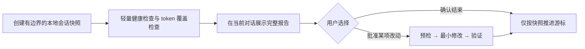

<div align="center">

# 🔄 AI Workspace Improver

### 把 AI 会话经验沉淀为更好的 Skills、规则与知识，而不是更多上下文债务

[](https://github.com/features/copilot)
[](https://openai.com/codex/)
[](https://www.python.org/)
[](LICENSE)

中文 · [English](README.en.md)

[为什么需要它](#-为什么需要它) · [它能做什么](#-它能做什么) · [快速开始](#-快速开始) · [工作流](#-工作流) · [隐私与边界](#-隐私与边界)

</div>

---

## 🤔 为什么需要它

AI 助手的每次协作都会留下信号：反复重试的工具调用、没有命中的 skill、过长的规则、过期的知识链接、被 sandbox 或网络阻塞的工作流。它们很有价值，却通常散落在聊天记录、配置目录和 wiki 中，最后变成没人维护的上下文债务。

`ai-workspace-improver` 是一个本地优先的治理 skill。它在你主动触发时复盘本机 Copilot 和 Codex 会话，同时检查管理中的 skills、共享规则、个人知识库和 workspace 结构。它交付可核查的建议，而不是自动“优化”你的环境。

你会得到的是：一次完整、直接显示在当前对话里的审查；清楚的覆盖缺口；以及由你逐项决定是否执行的最小改动方案。

## ✨ 它能做什么

| 你想解决的问题 | 触发方式 | 它会交付什么 |
| --- | --- | --- |
| 今天的 AI 协作哪里卡住了？ | `每日回顾`、`自我改进` | 归并后的会话覆盖、运行摩擦、已验证发现与下一步建议 |
| skill 和规则是否真的有用？ | `技能优化`、`skill review` | 触发词、职责、工作流和知识落点的改进候选 |
| token 花在哪里、数据是否可信？ | `token分析`、`token review` | 精确会话归因的 token 覆盖与聚合；没有数据时明确说明缺口 |
| workspace 是否开始变乱？ | `工作区诊断`、`workspace health` | 规则作用域、skill 元数据、wiki 索引/链接与受管资产检查 |
| 我想做一次深度资产体检 | `资产审计`，或加 `assets` | 受管 skills 与个人 wiki 的冗余、错位、陈旧内容候选 |

### 它关注的信号

- 逻辑会话中的失败重试、未闭环交付、工具缺口与可复用经验
- sandbox 权限拒绝、网络/fetch 失败、非零退出、权限升级及最终恢复状态
- skill 的触发词、职责与工作流是否重复、过窄或错位
- 共享 guidance 是否混入项目规则，个人 wiki 是否存在坏链接、陈旧路径或索引不一致
- 在可用时，按精确 session ID 归因的输入、缓存、输出和 reasoning token

PlantSim 本地帮助库被视为 `plantsim-agent` 的附属资产：只检查其声明、索引、检索配置和包结构，不把它当作个人知识库，也不会整体载入上下文。

## 🚀 快速开始

### 1. 安装

将本仓库放入你的 AI assistant 可发现的 skill 目录。使用共享 `.agents` 目录的环境可执行：

```bash
git clone https://github.com/JackySummerfield/ai-workspace-improver.git \
  ~/.agents/skills/ai-workspace-improver
```

不同客户端的 skill 目录可能不同；请以该客户端的官方文档或已有 skill 目录为准。若要使用完整的 workspace 健康检查，请将它安装在包含 `workspace.toml` 和 `bin/ai-workspace` 的 [ai-workspace](https://github.com/JackySummerfield/ai-workspace) 环境中。

### 2. 发起第一次审查

在支持的 AI assistant 中直接说：

```text
每日回顾
```

也可以指定焦点：

```text
每日回顾，重点检查 tokens 和 assets
```

首次使用不需要配置密钥、上传聊天记录或安装分析服务。审查完成后，完整结果必须直接出现在当前对话中；本地 Markdown 只是一份可追溯副本。

### 3. 选择要执行的改动

报告中的每个发现都会包含证据、影响、最小修改与验证方式。你可以批准个别项目、要求进一步分析，或确认结束。只有在你选择完成后，相应的会话片段游标才会推进。

## 🔎 工作流



每次审查都会进行轻量资产检查。每完成 5 次审查，或你明确要求 `assets` / 深度审计时，才会读取受管资产摘要并运行更深入的冗余与错位检查；它不会启动后台任务或定时服务。

## 📋 你会看到什么

```markdown
## Review summary
- Sources: Copilot 3 logical sessions; Codex 7 logical sessions (12 segments)
- Snapshot: review-...; not yet finalized

## Runtime incidents
- sandbox_permission ×2; recovered after approved escalation

## Token coverage
- ccusage: unavailable; Copilot Chat exact token coverage unavailable

## Asset health
- Errors: none
- Warnings: one global-rule scope candidate

## Findings
### F-03 — Move workspace publication policy out of global guidance
- Evidence: deterministic lint warning and inspected guidance
- Smallest change: move the project-only rule to root AGENTS.md
- Status: PENDING
```

报告始终包含以下部分，即使某些来源没有数据：

- 覆盖范围与局限：本次读取了哪些来源，哪些来源不可用
- workspace 健康、资产健康与运行环境事件
- token 覆盖状态：精确数据、来源级聚合或明确的不可用说明
- 可操作发现及待你选择的行动

## 🔐 隐私与边界

| 原则 | 实际行为 |
| --- | --- |
| 本地优先 | 只读取本机可用的 Copilot/Codex 历史和 workspace 资产；不上传原始会话 |
| 不保存聊天正文 | snapshot 只保存逻辑会话 ID、片段位置、时间和审计计数，不保存消息内容 |
| 不伪造数据 | 只有 session ID 精确匹配时才归因 token；Copilot Chat 无原生 usage 时只显示消息体量代理，绝不估算成本 |
| 不擅自改变环境 | 不自动修改资产、安装软件、运行远程脚本、提交/推送 Git、创建服务或定时任务 |
| 人在回路 | 健康问题默认是警告和人工复核候选；只有确定性的结构损坏才视为失败 |

### Token 数据

首个可选 provider 是 [ccusage](https://github.com/ryoppippi/ccusage)。skill 只检测它是否已经存在于 `PATH`，不会调用包管理器或自动下载。缺失时会显示固定的人工安装建议与覆盖缺口；可用时才读取其 JSON 输出。未明确触发的 skill 不会被猜测归因，而会标记为未知。

### 资产健康

`ai-workspace lint` 将确定性损坏作为失败项，例如 wiki 索引与文件不一致、坏 wikilink、缺失的 `SKILL.md` 或 frontmatter、无效引用、陈旧 canonical 路径、未登记受管资产。规则篇幅、职责/触发词重叠、双语 README 漂移、过大或疑似重复知识默认是警告，不阻断你的发布。

## 🛠️ 开发与贡献

```bash
# 在仓库根目录运行
python -m unittest discover -s tests -v
```

完整 workspace 中还可执行：

```bash
bin/ai-workspace lint --json
bin/ai-workspace doctor
```

修改审查能力前，请先阅读[能力迁移矩阵](references/migration-matrix.md)。它要求每项旧能力都有明确的 `KEEP`、`REPLACE` 或 `DEPRECATE` 决策、理由和验收测试，防止“升级”再次变成破坏性重写。

欢迎贡献新检查项、token provider 或来源适配器。请保持本地优先、可解释、默认不破坏用户资产，并为新增行为补充合成数据测试。

## 📄 License

MIT License. See [LICENSE](LICENSE).
