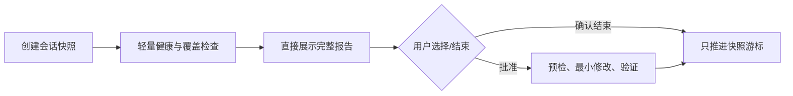

# AI Workspace 自我改进

中文 · [English](README.en.md)

`ai-workspace-improver` 是面向个人 AI workspace 的本地优先治理 skill：它复盘
Copilot 与 Codex 会话，检查 token 覆盖、运行摩擦、skills、共享规则、个人知识库与
workspace 结构，并只提出有证据的改进建议。

## 为什么做这个

会话历史能暴露失败重试、工具缺口、触发词遗漏和知识沉淀机会；同时，规则、skills 和
wiki 会随使用累积而产生错位、冗余和陈旧路径。本 skill 将两者放进同一个保守闭环，避免
“能采集会话”被误当作“资产健康”。

## 能力与边界

| 能力 | 说明 |
| --- | --- |
| 跨工具会话 | 采集本地 Copilot/Codex 增量；Codex rollout 按逻辑会话归并 |
| 完整交付 | 审查结果必须直接展示在当前对话；本地 Markdown 仅作副本 |
| Token 覆盖 | 可选读取已安装的 `ccusage`；绝不自动安装或伪造 Copilot 成本 |
| 运行摩擦 | 汇总 sandbox、网络、工具失败和权限升级类别，不保存原始输出 |
| 资产健康 | 每次轻量检查；每 5 次完成审查或显式 `assets` 时执行深度审计 |
| 安全变更 | 所有资产/Git 改动都需逐项选择；不会自动提交、推送或启动服务 |

PlantSim 帮助库属于 agent 附属资产，只检查索引与检索结构；它不是个人知识库，也不会被
整体读入上下文。

## 使用方式

在助手中输入 `每日回顾`、`自我改进`、`技能优化`、`token分析`、`工作区诊断` 或
`资产审计`。可选焦点：`conversations`、`tokens`、`assets`、`workspace`。



## 报告示例

```markdown
## Review summary
- Sources: Copilot 3 logical sessions; Codex 7 logical sessions (12 segments)
- Snapshot: review-...; not yet finalized

## Runtime incidents
- sandbox_permission ×2; recovered after approved escalation

## Token coverage
- ccusage: unavailable; Copilot Chat exact token coverage unavailable

## Asset health
- Errors: none
- Warnings: one global-rule scope candidate

## Findings
### F-03 — Move workspace publication policy out of global guidance
- Evidence: deterministic lint warning and inspected guidance
- Smallest change: move the project-only rule to root AGENTS.md
- Status: PENDING
```

## Token 数据限制

`ccusage` 是可选本地工具。skill 只检测已安装的二进制；若缺失，会报告覆盖缺口与人工
安装建议，不下载软件。只有 session ID 精确匹配的 token 数据才能归因到会话、项目或
显式触发的 skill。Copilot Chat 没有原生 usage 时仅显示消息体量代理，绝不显示估算成本。

## 本地状态与隐私

`review_state.json`、`reviews/`、`skill_change_log.md` 和 token 聚合摘要均被 Git
忽略。它们只保存游标、快照、脱敏发现和聚合指标；不会保存原始聊天、命令或工具输出。

## 开发与迁移

```bash
python -m unittest discover -s tests -v
```

运行 workspace 检查：`bin/ai-workspace lint --json`。修改本 skill 前请先阅读
[能力迁移矩阵](references/migration-matrix.md)：迁移必须明确保留、替换或废弃每项能力。
